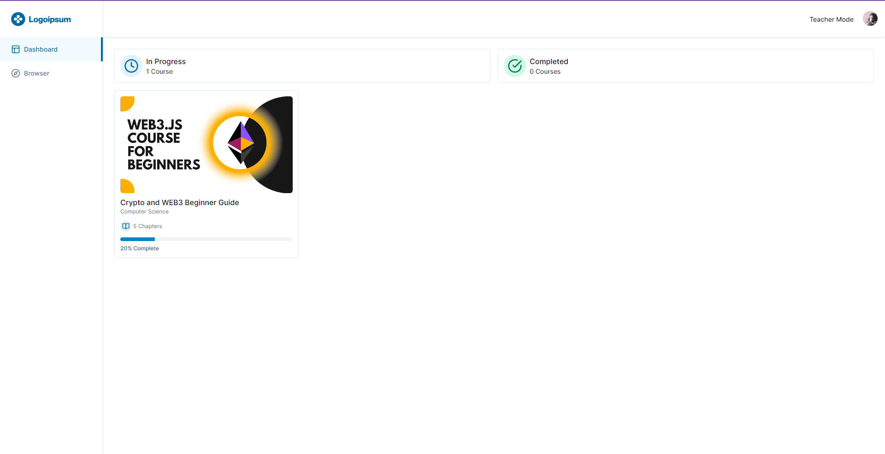
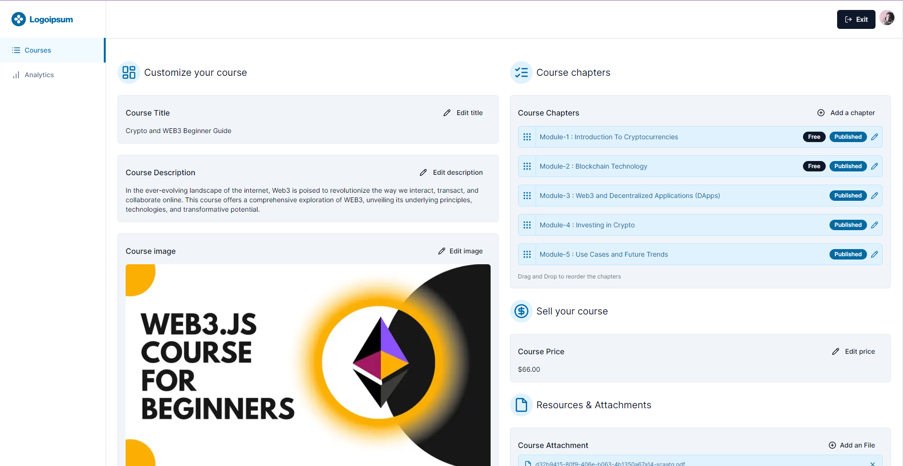

# LMS Platform: Learn, Teach, Succeed

Welcome to the LMS Platform repository, a comprehensive eLearning system built using Next.js, React, Stripe, Mux, Prisma, Tailwind, MySQL, and more.

Live Project URL : [Project Live-URL]("/")

## Table of Contents

- [LMS Platform: Learn, Teach, Succeed](#lms-platform-learn-teach-succeed)
  - [Table of Contents](#table-of-contents)
  - [Key Features](#key-features)
  - [Screenshots](#screenshots)
  - [Tech Stack](#tech-stack)
  - [Getting Started](#getting-started)
  - [Usage](#usage)
  - [Contributing](#contributing)
  - [License](#license)

## Key Features

- **Browse & Filter Courses**: Search and filter courses to find the content you're interested in.
- **Purchase Courses**: Seamlessly buy courses using Stripe integration.
- **Track Progress**: Mark chapters as completed or uncompleted to monitor your learning journey.
- **Progress Calculation**: See your progress for each course, making learning more effective.
- **Student Dashboard**: Access your personalized student dashboard for a user-friendly experience.
- **Teacher Mode**: Switch to teacher mode to create and manage courses.
- **Course Creation**: Easily create new courses tailored to your expertise.
- **Chapter Management**: Create new chapters and reorder them with drag and drop.
- **Multimedia Support**: Upload thumbnails, attachments, and videos using UploadThing.
- **Video Processing**: Utilize Mux for efficient video processing.
- **HLS Video Player**: Enjoy high-quality video playback using Mux.
- **Rich Text Editor**: Create detailed chapter descriptions with a rich text editor.
- **User Authentication**: Ensure secure access with authentication using Clerk.
- **ORM with Prisma**: Manage data efficiently with Prisma as your ORM.
- **Database Backend**: Use MySQL hosted on PlanetScale for a reliable database solution.

## Screenshots

## Tech Stack

- Next.js
- React
- Stripe
- Mux
- Prisma
- MySQL
- Tailwind CSS
- Clerk

## Getting Started

To get started with this project, follow these steps:

1. Clone the repository: `git clone https://github.com/yourusername/your-repo.git`
2. Navigate to the project directory: `cd your-repo`
3. Install dependencies: `npm install`
4. Configure environment variables as needed.
5. Start the development server: `npm run dev`
6. Access the application in your browser at `http://localhost:3000`.

## Usage

Provide detailed instructions on how to use your LMS platform, including key features, user guides, and special considerations.

## Contributing

Contributions are welcome! Fork the repository, make your changes, and create a pull request.

## License

This project is licensed under the MIT License - see the [LICENSE.md](LICENSE.md) file for details.

---

Created with passion by [Divyajyoti](https://github.com/Divyajyoti1801)
